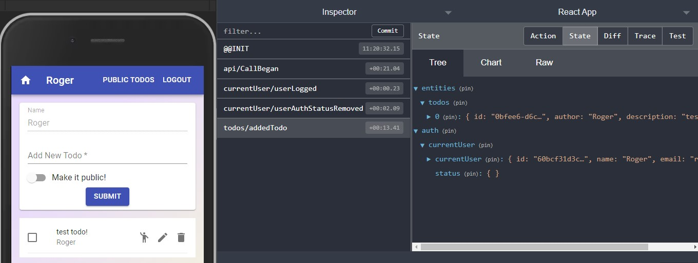

# Todo App on Steroids

### (not really, only a couple of features more 🍕)

> Todo app v2 with React, Redux, Node, Express and MongoDB

# Live demo

> https://vibrant-jones-a75ccc.netlify.app/



## Table of contents

- [General info](#general-info)
- [Features](#features)
- [Code Examples](#code-examples)
- [Setup](#setup)
- [Technologies](#technologies)
- [Status](#status)
- [Inspiration](#inspiration)
- [Contact](#contact)

## General info

Following my training I decided to create something that I could do to put more or less all the things I know about React.

You are watching v2, this includes Node, Express and MongoDB

## Features

You can:

- Toggle complete state, Add, Remove and Edit a todo
- Make it Public or Private
- See all Public Todos
- Register, Login and Logout

## Code Examples

```
export const todosSlice = createSlice({
  name: 'todos',
  initialState: [],
  reducers: {
    addedTodo: (state, action) => {
      state.push({
        id: uuid(),
        author: action.payload.name || 'anonymous',
        description: action.payload.description,
        completed: false,
        public: action.payload.public || false,
      });
    },
    toggledCompleted: (state, action) => {
      const index = state.findIndex((todo) => todo.id === action.payload);

      state[index].completed = !state[index].completed;
    },
    toggledEditing: (state, action) => {
      const index = state.findIndex((todo) => todo.id === action.payload);

      state[index].editing = !state[index].editing;
    },
    toggledPublic: (state, action) => {
      const index = state.findIndex((todo) => todo.id === action.payload);

      state[index].public = !state[index].public;
    },
    editedTodo: (state, action) => {
      const index = state.findIndex((todo) => todo.id === action.payload.id);

      state[index].description = action.payload.description;
    },
    deletedTodo: (state, action) => {
      const index = state.findIndex((todo) => todo.id === action.payload);

      state.splice(index, 1);
    },
  },
});
```

## Technologies

The project is created with:

- Hooks.
- Custom Hooks (useLocalStorage and useInputForm).
- Redux with a modern and clean approach using Redux Toolkit.
- Material UI
- React Router
- Ducks pattern
- Node
- Express
- MongoDB w/Mongoose
- Logical convention names, AKA past tense in redux actions, because when an anction has been dispatched it means that it has already happened, so its doesn't make sense to name it ADD or DELETE, it should be ADDED, or DELETED or even better todo/addedTodo or todo/removedTodo

## Setup

### `install node_modules`

### `npm start on main folder`

Runs the app in the development mode.\
Open [http://localhost:3000](http://localhost:3000) to view it in the browser.

The page will reload if you make edits.\
You will also see any lint errors in the console.

### `npm run dev on backend folder`

You may have to add your own path to the mongoDB server if you wish to see the development app, otherwise go to the live demo

## Contact

Created by Cudi - feel free to contact me!
